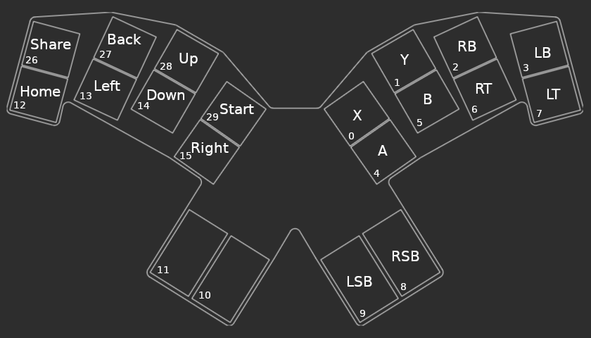

# Chouchou Keyboard/Fight Pad

Chouchou (Japanese for butterfly) is a minimalist unibody keyboard designed to be used with the [Taipo](https://inkeys.wiki/en/keymaps/taipo) layout, but it also can be used as a pretty nice fighting gamepad.

It uses a cheap RP2040-Zero MCU and requires no diodes since the 20 edge pinouts it provides is the exact number of keys Taipo requires. It was created with [Ergogen](https://github.com/ergogen/ergogen) and [KiCad](https://www.kicad.org). I designed it for my largish hands so if you have smaller hands its probably not going to be comfortable. I might make a more compact version in the future if people request it.

## Fight Pad / Pin Layout

## Build Your Own

### Board

#### Parts

- Send the [Gerber](kicad/gerber_to_order) file to the PCB manufacturer of your choice
- 1 x RP2040-Zero
- 20 x low profile choc switches and keycaps. Since you're going to be doing a lot of combos, I recommend lighter switches. I use 25g light blue, but 35g pro red is not bad either. You can use 1.5U keycaps for the thumbs, the socket has been rotated 90 degrees to accomodate.
- (optional) 20 x kailh hotswap sockets
- (optional) RP2040-Zero headers

#### Firmware

- [QMK](https://github.com/dlip/qmk_firmware/tree/chouchou/keyboards/chouchou)
  - Taipo Keyboard
  - PC Gamepad
  - Qwerty/WASD Layout
- [GP2040-CE](firmware/gp2040-ce)
  - PC or console gamepad
  - Note: PS5 requires an adapter like the [Wingman FGC](https://shop.brookaccessory.com/en/products/wingman-fgc)

#### Instructions

- Solder the RP2040-Zero to the board either directly or using the headers you purchased
- Build and flash the firmware
- You can test the keyboard at this point by connecting the hotswap pads with some metal tweezers before continuing
- Solder the kalih hotswap sockets if purchased or solder the switches directly the board otherwise
- Insert the switches into the hotswap sockets if necessary
- Add your keycaps 

### Case

Issue: The case gets blocked by one of the screw mounts when using hotswap sockets, its easy enough to cut the side a bit with a knife though. 

#### Parts

The screws/nuts are optional, its a pretty tight fit so you might not need them.

- 3D print the [case.stl](case/case.stl) file
- (optional)  8 x Knurled Insert Nuts (M2 x 3mm Length x 3.2mm OD) [example](https://www.amazon.com/dp/B07LBQFNQD)
- (optional) 8 x M2 3mm flat screws [example](https://www.amazon.com/gp/product/B01FTI8TM8/) 

#### Instructions

- Use a soldering iron to melt the insert nuts into the holes in the case
- Screw the board to the case

### Attribution

Butterfly image by [Freepik](https://www.freepik.com/free-vector/hand-drawn-butterfly-outline-pack_15636314.htm#query=butterfly&position=29&from_view=keyword&track=sph)